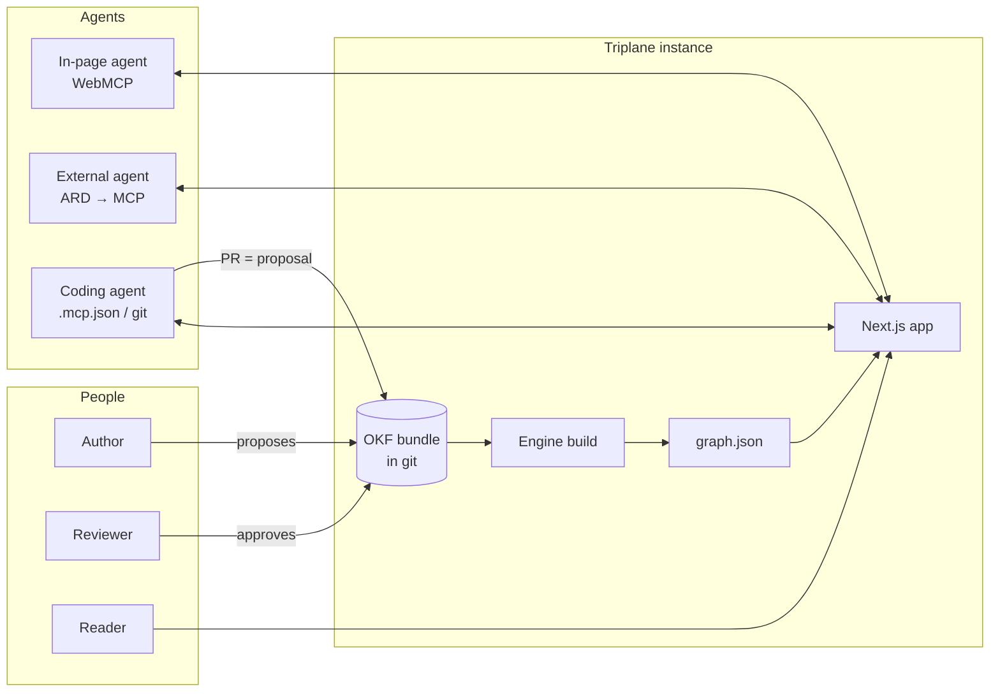
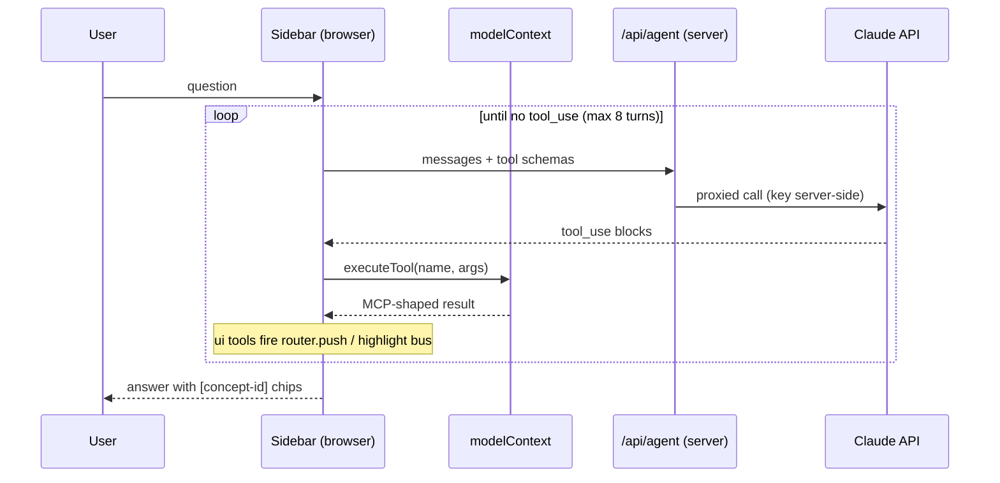
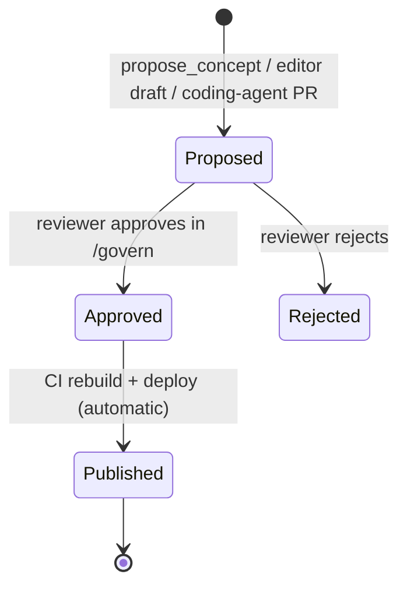

# Triplane — Technical Architecture

Audience: engineers building, extending, or operating a Triplane instance. Product rationale lives in `triplane-spec.md`; this document covers how the system is constructed, why it is shaped this way, and where the boundaries are. Verified state as of v0.1: engine, compiler, tool contract, MCP handler, and both bundles pass typecheck, lint, greptest, and smoke tests; the web app is scaffolded (tasks T1–T8 in `CLAUDE.md`).

## 1. System context

Triplane is a build-time compiler plus a thin runtime that serves one governed knowledge graph to three classes of consumer over four transports.



The system boundary is a single deployable web application per bundle. There is no database, no queue, and no long-running service beyond the web app itself: the bundle in git is the system of record, `graph.json` is the only runtime data artifact, and everything else is stateless request handling. This is a deliberate constraint — see ADR-1.

## 2. Repository and component architecture

npm-workspaces monorepo, Node 22, TypeScript strict, ESM throughout.

```
triplane.config.ts        the entire white-label surface (brand, publisher, planes, store)
bundles/<name>/           OKF content — markdown + YAML frontmatter, one file per concept
packages/engine/          pure library: compiler, tool contract, adapters, stores, catalogs
packages/cli/             build pipeline + reference external ARD agent
apps/web/                 Next.js 15 app: pages, graph view, sidebar agent, API routes
scripts/                  greptest.sh (bundle-agnosticism gate), smoke.mts (contract test)
```

Dependency rules, enforced by review and by `scripts/greptest.sh` in CI:

`engine` depends on nothing framework-shaped — its only runtime deps are `gray-matter` and `minisearch`, it compiles against `lib: ES2022` with no DOM types, and it must contain zero bundle-specific strings. `cli` depends on `engine` and the root config. `apps/web` depends on `engine` and renders it; nothing depends on `apps/web`. Volatile external surfaces are quarantined one-per-file: the WebMCP browser API exists only in `engine/src/adapters/webmcp.ts` (reached via `globalThis`, which is what keeps the engine DOM-free), the MCP wire protocol only in `engine/src/adapters/mcp.ts`, and the GitHub REST API only in `engine/src/stores/github.ts`. When any of these ecosystems moves — and WebMCP is an origin trial, so it will — the blast radius is one file.

### Module responsibilities

| Module | Responsibility | Key exports |
|---|---|---|
| `engine/compile.ts` | OKF dir → typed graph + lint issues | `compileBundle` |
| `engine/tools.ts` | The single tool contract + graph algorithms | `buildTools`, `shortestPath` |
| `engine/adapters/webmcp.ts` | Register/execute tools via `document.modelContext` | `registerWebmcpTools`, `executePageTool` |
| `engine/adapters/mcp.ts` | Stateless MCP JSON-RPC handler (read tools only) | `createMcpHandler` |
| `engine/stores/*` | `BundleStore` seam: fs (dev) and GitHub PR (prod) | `fsStore`, `githubStore` |
| `engine/catalog.ts` | Plane-3 artifacts | `buildAiCatalog`, `buildLlmsTxt` |
| `cli/build.ts` | compile → lint gate → emit artifacts to `apps/web/public` | — |
| `cli/ard-agent.ts` | Reference external client: discover → verify → connect → answer | — |

## 3. Data model and artifact contract

An OKF concept is one markdown file. Frontmatter requires `type`; `id` defaults to the filename stem; typed relationships come from `links: [{to, rel}]`; `[[wikilinks]]` in the body become `mentions` edges. The compiler emits one artifact:

```ts
interface Graph {
  nodes: ConceptNode[];   // id, type, title, path, frontmatter, excerpt, body
  edges: ConceptEdge[];   // from, to, rel — deduplicated
  index: unknown;         // serialized MiniSearch over id/title/body/type
  bundleHash: string;     // sha256(concatenated sources), first 12 hex chars
  builtAt: string;
}
```

`graph.json` is the contract between build time and run time, and the only coupling among the three planes. Every plane — server-rendered pages, the browser tool runtime, the MCP handler — deserializes this same file; none of them ever re-parses markdown at request time (the one exception is `/api/bundle`, which serves raw source for agents that want OKF itself). `bundleHash` appears in the catalog and can be echoed by clients for cache validation; a hash change is the formal signal that "the knowledge changed."

Edge relations are open-vocabulary, but four (`source`, `depends_on`, `defines`, `joins`) are lineage-bearing: `explain_metric` computes upstream closure over exactly this set, and `shortestPath` prefers forward edges over reverse traversal at equal depth so join paths follow semantic lineage rather than incidental backlinks. Adding a lineage relation means updating one constant in `tools.ts`.

Lint severity is the build gate: broken links, duplicate ids, and missing `type` are errors and fail the build; orphan nodes warn. This is knowledge CI — a bad merge cannot produce a deployed graph.

## 4. Build pipeline and deployment topology

```
tsx packages/cli/src/build.ts bundles/<name>
  → compileBundle()           parse, link, lint
  → exit 1 on lint errors     (the gate)
  → emit apps/web/public/graph.json
  → emit apps/web/public/.well-known/ai-catalog.json
  → emit apps/web/public/llms.txt
  → next build (in CI)
```

Deployment is N instances of one engine, differing only in environment:

| Env var | Meridian instance | Docs instance |
|---|---|---|
| `TRIPLANE_BUNDLE` | `meridian` | `triplane-docs` |
| `ANTHROPIC_API_KEY` | set (server-only) | set (server-only) |
| `NEXT_PUBLIC_WEBMCP_OT_TOKEN` | per-origin trial token | per-origin trial token |
| `GITHUB_TOKEN` + `TRIPLANE_REPO` | set in reviewer deployment | optional |

Vercel build command: `npx tsx packages/cli/src/build.ts bundles/$TRIPLANE_BUNDLE && npm run build --workspace apps/web`. CI on pull requests runs typecheck, greptest, and a build of the changed bundle, publishing a preview URL — so a proposal's reviewable form includes a fully rendered preview of all three planes. CI on merge to main rebuilds and promotes. That mechanism is what makes "approval is the deploy" literally true rather than a slogan.

## 5. Runtime architecture

### Plane 1 — human site

Next.js App Router. Concept pages and the home page are server components that read `public/graph.json` from the filesystem (`outputFileTracingIncludes` pins it into the serverless bundle), render markdown via `marked`, and rewrite wikilinks to `/c/<id>` routes. `GraphView` is a client component (`react-force-graph-2d`) drawing the monochrome graph; it subscribes to a page-local `EventTarget` bus for highlight events. Design tokens live in `globals.css`; the accent color renders agent activity and nothing else.

### Plane 2 — in-page agent

The defining constraint: two of the eight tools (`open_concept`, `highlight_subgraph`) mutate the visible page, so tool execution must happen in the browser. Therefore the agent loop is browser-driven and only the model call crosses to the server.



`WebMCPProvider` owns the registration lifecycle: on every route change it recomputes the page's concept `type`, unregisters the previous set, and registers `scope: "global"` tools plus any `scope: {pageType}` matches — which is what fires `toolchange` for connected agents and gives the dynamic-toolset behavior (e.g. `compare_metrics` exists only on metric pages). The sidebar prefers `modelContext.executeTool` when the browser exposes it, proving the real API path; otherwise it invokes the identical contract directly with an injected `UIBridge`. Same tools, same results, with or without the origin trial — the fallback is not a degraded mode, it is the same code path minus the registry.

Abort semantics: one `AbortController` per question, threaded through fetch and `executeTool`; Stop is honored mid-loop.

### Plane 3 — ecosystem

Three read surfaces generated from the same build: `/.well-known/ai-catalog.json` (ARD-pattern manifest: publisher identity, `bundleHash`, capability list), `llms.txt` (the low-tech pointer), and `/api/bundle` (raw OKF listing and file fetch, path-traversal-guarded). Plus one live surface: `/api/mcp`, a stateless JSON-RPC handler implementing `initialize`, `tools/list`, and `tools/call` over the read-only tool subset. Statelessness is load-bearing — each POST rebuilds context from `graph.json`, so the endpoint scales as pure serverless functions with zero session affinity and nothing to replay after a cold start. It implements the POST half of Streamable HTTP and no more: no `Mcp-Session-Id` is issued and `GET` returns 405, declining the optional server→client stream. Both are choices the spec grants, which is why the catalog's `transport: "streamable-http"` claim holds — verified against real clients. The official MCP SDK replaces the hand-rolled handler when session features (resumability, notifications) are needed; the swap is confined to `adapters/mcp.ts` and the route.

External consumption paths, in increasing intimacy: read `llms.txt`; fetch the catalog; fetch raw OKF; connect over MCP (desktop clients via custom-connector URL, coding agents via a committed `.mcp.json`, or **any host at all via the ARD plugin in `plugins/triplane-ard`, which starts from a bare domain rather than a known endpoint**); and for coding agents, clone the repo and open a PR — which enters the governance flow like any other proposal.

## 6. Tool contract and transport exposure

Defined once in `tools.ts`, mounted per transport by `kind`. This matrix is the security model's first half:

| Tool | kind | scope | WebMCP (browser) | MCP (hosted) |
|---|---|---|---|---|
| `search_concepts` | read | global | ✓ | ✓ |
| `get_concept` | read | global | ✓ | ✓ |
| `get_join_path` | read | global | ✓ | ✓ |
| `explain_metric` | read | global | ✓ | ✓ |
| `compare_metrics` | read | metric pages | ✓ (scoped) | ✗ (scope is not global) |
| `open_concept` | ui | global | ✓ | ✗ |
| `highlight_subgraph` | ui | global | ✓ | ✗ |
| `propose_concept` | write | global | ✓ (reviewer mode) | ✗ |

Invariants: `ui` tools never leave the browser because they actuate a session's DOM; `write` tools never mount on the hosted endpoint and, even in the browser, execute only when a `BundleStore` is injected (reviewer mode). Results are MCP-shaped (`{content:[{type:"text",text}]}`) on both transports so client code is transport-agnostic. Handlers are pure functions of `(args, {graph, ui?, store?})` — trivially unit-testable, as `scripts/smoke.mts` demonstrates.

## 7. Governance and storage

`BundleStore` is the write seam: `read/list/propose/approve/reject/history`. Two implementations ship — `fsStore` (proposals as files under `.proposals/`, for dev and demo) and `githubStore` (branch + PR = propose, squash-merge = approve, commit log = history). The proposal lifecycle:



Two principles govern this design. Git is the ledger, never the door: authors and agents see Draft → In review → Published, while git supplies immutable history, diffs, and point-in-time reconstruction underneath — and because the door is the `BundleStore` interface, a non-git backend (database, CMS) can satisfy the same contract for organizations where git is a non-starter. And there is exactly one write path: every mutation, from any actor over any transport, becomes a proposal that a human approves. There is no privileged path around the gate, including for operators — publishing means merging.

## 8. Security model

Trust boundaries, outermost first. The Anthropic API key exists only server-side; the browser talks to `/api/agent`, a thin proxy that injects the key and the system prompt (which enforces tool-grounded answers, bracket citations, and the highlight call). The hosted MCP endpoint exposes read tools only, so the worst a hostile external agent can do is read what the site already publishes. WebMCP tools run inside the page's own origin with the user's own session — they grant an agent nothing the user couldn't click, and the Permissions-Policy / origin-trial mechanism gates which embedding contexts see them at all. Writes require reviewer mode (store injection) and still only yield proposals. `/api/bundle` normalizes and rejects traversal paths. Content-level policy is authored into the bundle itself — e.g. Meridian's `pii-handling` concept mandates aggregate-and-id-only outputs — which the review gate then enforces on every change to tool-visible content. Known gaps, owned on the roadmap: no auth on read surfaces (fine for public knowledge; OAuth per the MCP auth spec for private bundles), no signed catalogs yet (ARD verification is publisher-metadata-grade), and rate limiting delegated to the platform edge.

## 9. Cross-cutting concerns

Performance: the whole system is sized around `graph.json` staying small. At the hundreds-of-concepts scale this design targets, the artifact is tens to a few hundred KB — cheap to ship to the browser, cheap to parse per serverless invocation, and MiniSearch stays comfortably in-memory. The documented ceiling is roughly a few thousand concepts per bundle; beyond that, the design answer is sharding into multiple bundles (multiple instances) rather than introducing a database, because one-bundle-one-instance is also the isolation and white-label story.

Observability: every agent interaction on both transports flows through two chokepoints — `/api/agent` and the MCP handler — so logging tool name, args shape, latency, and cited concept ids at those two points yields complete agent analytics (the commercial feature) without touching the engine. Add structured logs there first; a metrics sink is an operator concern, not an engine one.

Failure and degradation ladder, from the top: no WebMCP in the browser → identical behavior via the direct-contract fallback; Claude API down → sidebar reports the error, Planes 1 and 3 static surfaces unaffected; store misconfigured → writes decline gracefully ("no store attached"), reads unaffected; build lint failure → previous deploy keeps serving, nothing partial ever ships. The system has no state to corrupt at runtime — the worst runtime outcome is a stale-but-consistent graph.

Testing: `smoke.mts` covers the contract and MCP round-trip; `greptest.sh` covers bundle-agnosticism; lint covers content integrity. The gaps to close as the team grows are unit tests around `shortestPath`/upstream-closure edge cases and a Playwright pass over the T2 sidebar flow.

## 10. Architecture decision records

| # | Decision | Rationale | Revisit when |
|---|---|---|---|
| 1 | No database; git bundle + `graph.json` artifact | Zero ops surface, atomic three-plane deploys, point-in-time audit for free | Bundle > ~few-thousand concepts or sub-minute publish latency required |
| 2 | Browser-driven agent loop, server-side model proxy | `ui` tools must touch the DOM; key must not reach the client | A server-orchestrated mode is added for headless embedding |
| 3 | One tool contract, per-transport mounting by `kind` | Single source of truth; security by construction, not by review | Never — this is the core invariant |
| 4 | Stateless hand-rolled MCP handler first, SDK transport later | Serverless-friendly, zero session state, demo-sufficient | Strict clients require full Streamable HTTP semantics (T3) |
| 5 | WebMCP quarantined in one adapter, reached via `globalThis` | Origin-trial churn absorbed in one file; engine stays DOM-free and isomorphic | WebMCP reaches standards stability |
| 6 | Git as ledger behind a `BundleStore` seam, never as UX | Audit + history without imposing git on authors; backend swappable | An enterprise mandates a non-git system of record |
| 7 | Engine bundle-agnosticism enforced by grep in CI | White-label claim is testable, not aspirational | Never |

## 11. Extension points

Where the roadmap plugs in without re-architecture: new tools are entries in `buildTools()` and inherit both transports and the exposure rules; new knowledge sources (Confluence/SharePoint sync) are producers that emit OKF into the bundle and ride the same gate; auth wraps the API routes; signed catalogs extend `catalog.ts`; agent analytics instruments the two chokepoints; a second product surface (e.g. a session-export from a collaboration tool) integrates by writing a bundle and opening proposals — the gate is the integration API.
