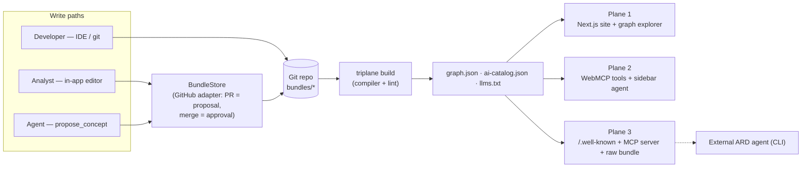

# Triplane — Feature Set & Architecture (v1, hackathon scope)

> **Triplane is a publishing engine for the agentic web.** One OKF knowledge bundle in; three audiences served at once — humans get a website, in-page agents get WebMCP tools, the agent ecosystem gets ARD discovery.
>
> Engine = product. **Meridian** (retail data knowledge) = demo bundle. **Triplane's own docs** = second bundle, proving white-label. Git = ledger, never the door.

---

## 1. Feature Set

### 1.0 Core engine (`packages/engine`)

| Feature | Description |
|---|---|
| OKF compiler | Parses a bundle directory (markdown + YAML frontmatter), resolves `[[wiki-links]]` and frontmatter refs into a typed graph |
| Build artifacts | Emits `graph.json` (nodes, edges, search index), `ai-catalog.json`, `llms.txt` |
| Bundle lint | Fails build on: broken links, missing `type`, duplicate ids. Orphan nodes warn — a new concept is an orphan until something links to it, and failing there would block the first proposal of any topic |
| Config | Single `triplane.config.ts` — the entire white-label surface |
| Grep test (CI) | `grep -ri meridian packages/` must return zero hits — engine is provably bundle-agnostic |

### 1.1 Plane 1 — Human site (`apps/web`)

| Feature | Description |
|---|---|
| Concept pages | One route per node; rendered markdown, frontmatter facts panel, inbound/outbound link lists |
| Graph explorer | Force-directed view of the whole bundle; click-through to pages |
| Agent-activity highlighting | Monochrome ink-on-paper UI; the **single accent color is reserved for agent actions** — nodes pulse as the agent traverses |
| Provenance chips | Every agent answer renders concept-ID chips that deep-link to source pages |
| Search | Client-side full-text over `graph.json` index (also backs the `search_concepts` tool) |
| Reviewer mode | Toggle exposing the governance console (proposals, diffs, approve/reject, history) |

### 1.2 Plane 2 — In-page agent (WebMCP)

| Feature | Description |
|---|---|
| WebMCP registration | Tools registered on `document.modelContext` (feature-detect `navigator.modelContext` alias); origin-trial token on deployed domain |
| Dynamic tools | Page-scoped tools register/unregister on navigation → fires `toolchange` (e.g. `compare_metrics` only on metric pages) |
| Sidebar agent panel | `getTools()` → Claude (server proxy) → `executeTool()` loop; streaming answers with provenance chips |
| Cancellation | Stop button wires `AbortSignal` through `executeTool` into handlers |
| DevTools-verifiable | All tools inspectable/invokable via Chrome's WebMCP DevTools extension (the "it's the real standard" proof) |

**Tool contract (shared, single definition):**

| Tool | Kind | Scope | Purpose |
|---|---|---|---|
| `search_concepts(query)` | read | global | Ranked concept hits with ids |
| `get_concept(id)` | read | global | Full body + frontmatter + edges |
| `get_join_path(from, to)` | read | global | Shortest path through the graph — the wow tool |
| `explain_metric(name)` | read | global | Metric definition + upstream lineage |
| `open_concept(id)` | ui | global | Navigate the visible page |
| `highlight_subgraph(ids)` | ui | global | Pulse nodes/edges in accent color — **the demo; never cut** |
| `compare_metrics(a, b)` | read | metric pages | Dynamic-registration showcase |
| `propose_concept(path, md, message)` | write | reviewer mode | Agent-drafted concept → governance gate (never a direct commit) |

### 1.3 Plane 3 — Ecosystem (ARD + MCP)

| Feature | Description |
|---|---|
| ARD manifest | `/.well-known/ai-catalog.json` generated from config: publisher metadata + two capabilities (raw OKF bundle endpoint, hosted MCP server). Shape validated during build by `validateAiCatalog` in `@triplane/ard` — the same function a stranger's discovery client runs against it |
| `llms.txt` | Pointer file → manifest + bundle |
| Hosted MCP server | Same `tools.ts` read-tools mounted at `/api/mcp` (a hand-rolled Streamable HTTP subset: POST only, no session id, `GET` → 405. All three are permitted by the spec) |
| Raw bundle endpoint | `/api/bundle` serves the OKF directory (tarball + per-file) for agents that want the markdown itself |
| Reference ARD agent | `packages/cli`: ~100-line headless client doing the full loop — fetch catalog → pick capability → connect → answer the WAU question citing the same concept IDs the sidebar cites |

### 1.4 Governance & authoring (the non-dev write path)

| Feature | Description |
|---|---|
| In-app editing | "Edit concept" opens markdown editor in browser; humans never see git |
| Agent drafting | Sidebar can draft a concept from pasted text via `propose_concept` |
| Propose → judge → approve | Every write becomes a PR (branch) via `BundleStore`; reviewer sees rendered diff; **Approve = merge = the only write to main** |
| Audit trail | History view = annotated git log per concept |
| Three write paths, one ledger | In-app UI / agent proposals / dev IDE — all converge on the same repo |

### 1.5 White-label surface

| Feature | Description |
|---|---|
| `triplane.config.ts` | Bundle path, brand (name, accent), publisher metadata, plane toggles, store backend — nothing else to touch |
| Two live instances | `bundles/meridian` (retail: 3 schemas, 2 metrics incl. `weekly_active_users`, join paths, runbook, glossary) + `bundles/triplane-docs` (~5 concepts, self-hosting) |
| Instance flip | Two deployments of the same repo differing only in `TRIPLANE_BUNDLE` env — white-label proven by URL, not by claim |

### 1.6 Tiers

- **Must (demo dies without):** compiler, concept pages, graph view + highlighting, 6 global tools, sidebar loop, ai-catalog.json, CLI agent, in-app approve flow, both bundles.
- **Should:** dynamic page-scoped tools, llms.txt, history view, bundle lint, AbortSignal.
- **Cut lines (in order, if squeezed):** hosted MCP transport (keep raw-bundle capability — ARD story survives) → `compare_metrics` → history view. **Never cut `highlight_subgraph`.**

---

## 2. Architecture

### 2.1 System diagram



### 2.2 Repo layout (npm workspaces)

```
triplane/
├── packages/
│   ├── engine/          # compiler, graph types, tools.ts, adapters, stores — zero bundle refs
│   │   └── src/
│   │       ├── compile.ts        # OKF → graph.json
│   │       ├── tools.ts          # single tool contract
│   │       ├── adapters/
│   │       │   ├── webmcp.ts     # registerWebmcp(tools, ctx)
│   │       │   └── mcp.ts        # mountMcp(readTools, ctx)
│   │       ├── stores/
│   │       │   ├── store.ts      # BundleStore interface
│   │       │   └── github.ts     # Octokit adapter
│   │       └── catalog.ts        # ai-catalog.json + llms.txt generators
│   └── cli/             # `triplane build|dev` + ard-agent.ts (reference client)
├── apps/
│   └── web/             # Next.js App Router: pages, graph view, sidebar, governance console, /api/*
├── bundles/
│   ├── meridian/        # demo content (pure markdown)
│   └── triplane-docs/   # self-hosting bundle
└── triplane.config.ts
```

### 2.3 Key interfaces

```ts
// engine/src/types.ts
export interface TriplaneConfig {
  bundle: string;
  brand: { name: string; tagline?: string; accent: string };   // accent = agent-activity color only
  publisher: { name: string; domain: string; contact?: string }; // → ai-catalog.json
  planes: {
    webmcp: { enabled: boolean; originTrialToken?: string };
    ard:    { enabled: boolean; mcp: boolean };
  };
  store: { kind: "github"; repo: string; base: string } | { kind: "fs" };
}

export interface ConceptNode {
  id: string; type: string; title: string; path: string;
  frontmatter: Record<string, unknown>; excerpt: string;
}
export interface ConceptEdge { from: string; to: string; rel: string }
export interface Graph {
  nodes: ConceptNode[]; edges: ConceptEdge[];
  index: SerializedIndex; bundleHash: string; builtAt: string;
}

export type ToolKind = "read" | "ui" | "write";
export interface ToolDef<I = unknown> {
  name: string; description: string; inputSchema: JSONSchema;
  kind: ToolKind;
  scope: "global" | { pageType: string };      // drives dynamic registration + toolchange
  handler(args: I, ctx: ToolCtx): Promise<ToolResult>;
}
export interface ToolCtx { graph: Graph; ui?: UIBridge; store?: BundleStore }
// ui only exists in the browser adapter; store only where writes are allowed

export interface BundleStore {
  read(path: string): Promise<string>;
  list(): Promise<string[]>;
  propose(c: { path: string; content: string; message: string }): Promise<{ id: string; diffUrl: string }>;
  approve(id: string): Promise<void>;   // merge PR — the only write to main
  reject(id: string): Promise<void>;
  history(path?: string): Promise<{ sha: string; message: string; author: string; at: string }[]>;
}
```

**Adapter rule:** `webmcp.ts` registers all tools whose scope matches the current page and injects `UIBridge`; `mcp.ts` mounts **read tools only** (no UI, no writes leave the browser gate). One contract, two transports, asymmetric by design.

### 2.4 Agent loop (browser-driven — the trickiest bit)

WebMCP handlers touch the DOM, so execution must stay client-side; only the model call is proxied:

```
sidebar                    /api/agent (server)            browser page
  │ getTools() ──────────────────────────────────────────► document.modelContext
  │ POST {messages, toolSchemas} ──► Claude API
  │ ◄── tool_use ────────────────────┘
  │ executeTool(name, args) ────────────────────────────► handler runs, UI updates
  │ append tool_result, POST again ─► Claude API
  │ ◄── final text + concept-id citations
```

- API key lives server-side only; route is a thin passthrough.
- `ui` tools return one-line confirmations (`"highlighted 4 nodes"`) to keep tokens lean.
- Stop button aborts the fetch **and** forwards `AbortSignal` into `executeTool`.

### 2.5 Build pipeline

`triplane build <bundle>`: parse frontmatter → resolve links → lint → emit `graph.json` → generate `ai-catalog.json` (from `publisher` + enabled capabilities; validate shape against ard-spec) → emit `llms.txt`. Runs in CI on merge; Vercel redeploys. **Result: one approved proposal updates all three planes — the closing demo beat is a side effect of the architecture.**

### 2.6 Deployment

- **Vercel, two projects, one repo:** `meridian-…` and `docs-…`, differing only in `TRIPLANE_BUNDLE`. Stable domains matter — the WebMCP origin-trial token is issued per origin (meta tag injected from config).
- Local dev: WebMCP DevTools extension for tool inspection; sidebar loop works everywhere since it uses the same API directly.
- (Azure Container Apps is drop-in later; Vercel wins the weekend.)

### 2.7 Spec-reality guardrails

1. Feature-detect `document.modelContext ?? navigator.modelContext`; never assume either.
2. Expect renames — the API is an origin trial; pin `webmcp-types` and isolate all WebMCP touches in `adapters/webmcp.ts`.
3. `exposedTo` left default (top-level + built-in agents); no cross-origin exposure in v1.
4. Write safety: `propose_concept` is the only write tool, it can only create proposals, and approval is a human click in reviewer mode. State this on stage — it's your governance story.
5. Boring schemas: flat objects, string/enum params, required fields explicit.

---

## 3. Demo beat → feature map

| Beat (3 min total) | Features exercised |
|---|---|
| Browse Meridian site + graph (15s) | Plane 1 |
| Ask the WAU question; graph lights up hop-by-hop; answer with provenance chips (60s) | tools, sidebar loop, `highlight_subgraph`, chips |
| Open WebMCP DevTools ext; invoke `get_join_path` manually (20s) | real-standard proof |
| Terminal: CLI agent discovers via ai-catalog.json, answers headlessly, same concept IDs (40s) | Plane 3 |
| In-app: agent drafts a concept → Approve → site, tools, and catalog all update (45s) | governance, BundleStore, build pipeline |
| Flip to docs-instance URL: "the docs for this engine are a Triplane instance" (15s) | white-label |

Closing line: **"One commit. Three planes. Authors never see git; git sees everything."**

## 4. Build order (weekend)

1. **D1 AM** — Meridian bundle + compiler + lint (`graph.json` is the keystone; content must be genuinely graph-shaped).
2. **D1 PM** — Site: concept pages, graph explorer, monochrome system.
3. **D2 AM** — `tools.ts` + WebMCP adapter + sidebar loop + highlighting.
4. **D2 PM** — ai-catalog.json + MCP mount + CLI agent + governance flow + `triplane-docs` bundle.
5. **Final hours** — accent animation polish, lint pass on bundles, rehearse the six beats twice.

## 5. Non-goals (v1)

Auth/RBAC (reviewer mode is a toggle) · sync adapters for Confluence/SharePoint/Notion (roadmap slide only) · theming/plugin system · multi-bundle in one deployment · ontology layer (name-drop as roadmap; don't build).
